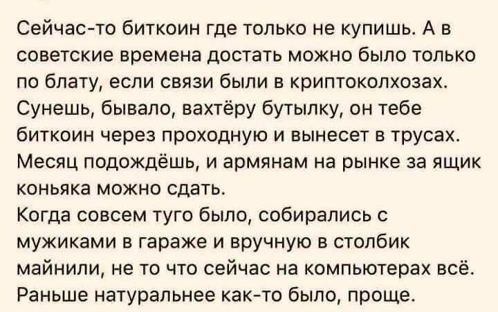

- Гонец
	- Наступает неясное чувство, и его приносит гонец. Он играет на трубе и губной гармони, с собой он несет акустическую гитару и какие-то ударные побрякушки. Его песня взывает к забытой, несуществующей тоске. Ретузы поют мне о ласточке, об ослепительных ночах непосещенной страны, о слепом капитане, которому снится дно.
	- Подключаются струнные, и вдруг я уже в Ревашоле. На руинах города нет надежды найтись — точнее, ее не видно. Мурашками чувствуются голоса в ветре — они шепчут о своих делах, а здания вторят им забытыми событиями прошлого. На самом деле надежда есть, это она через трубы освещает сознание всех вокруг. Это она начинает трепетать, почти что выть, и заполняет бессонным рассветом душу.
	- Становится светло и тихо, и город уже вот-вот начнет шуметь.
- [[Цитаты]]
	- This life is not about loving anybode else
	  At first you lose control
	  And then you lose yourself
	- This life is not about loving honey
	  At first you lose control
	  And then you lose your money
	- Оказывается, об этой песне никто не знает
- [[Абстрактные идеи]]
	- противоположность депрессии — не радость, а самовыражение (expression)
	- 
-