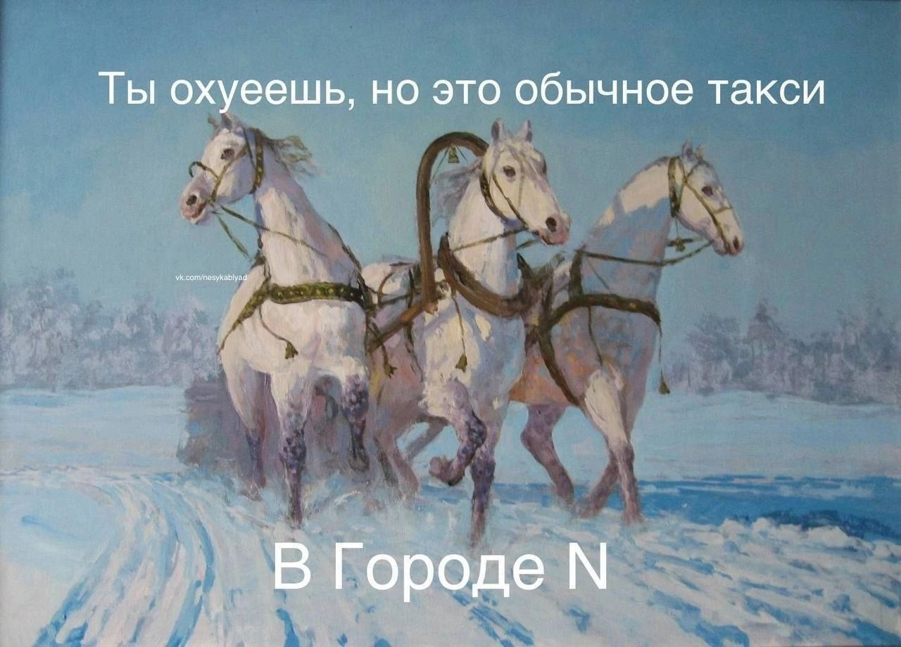

- [[Музыка]]
	- Beirut -- всего два альбома на яндекс музыке, но какие трубы! Вот [пример](https://music.yandex.ru/album/6637608/track/44223045?utm_medium=copy_link)
- Как из ничто появляется что? Откуда берутся физические и семантические законы-стенки, которые работают как резонатор: выделяют только некоторые структуры, которые могут существовать устойчиво?
- В прошлые выходные мы ехали на такси в поселок под Подольском, и я не мог отделаться от мысли, что такси -- это просто осовремененная карета. Можно представить себя лет так 200 назад, как под мерный стук копыт идеи медленно копошатся в голове, ведь заняться в дороге особо нечем. Можно смотреть в окно и видеть бесконечный простор, даже сейчас он там. И грязные неасфальтированные дороги там, и московские электробусы там, и странная старинная церковь там, и заброшенные дома посреди ничего там, и пиковские миры в майнкрафте там.
	- 
-