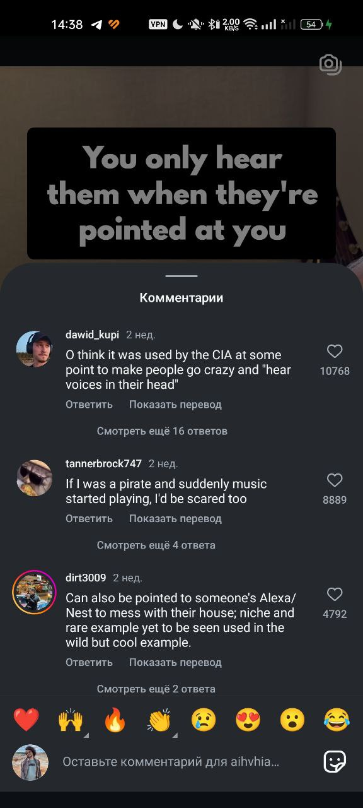

- [[Поиск пути с начала и конца]]
- [[Математический алгоритм оптимального принятия решений]]
- [[Как использовать отсутствие свободы воли]]
- [[Роман Михайлов]]
- TODO разобрать
- Enshittification
	- upholding the end-to-end principle, which asserts that platforms should transmit data in response to user requests rather than algorithm-driven decisions; and guaranteeing the right of exit — that is, enabling a user to leave a platform without data loss, which requires interoperability. These moves aim to uphold the standards and trustworthiness of online platforms, emphasize user satisfaction, and encourage market competition.
- Старая Москва -- [рилс](https://www.instagram.com/reel/DGV3EVLoHSq/?igsh=N2g4cHp2aXk0MHZt)
- Главный вопрос не «что это значит?» а «как это работает?», или лучше того «может ли это работать по-другому?»
- Откуда изображение коровы, которую похищает НЛО? Когда появилась концепция НЛО в символьном пространстве?
- Криптография и стеганография в социальных сетях
- Мемы — сериал распределенного авторства
- Разные [виды](https://www.instagram.com/reel/DHHuJlhSVm7/?igsh=MTU2cnBneHljaTc4bA==) вредоносных флешек
- Добавьте запас прочности. Потому что, как показывает практика, жизнь всегда найдёт способ нас удивить.
- В каждой области есть не так много ключевых, абстрактных идей
- Пишешь хорошо, но пишешь не о том
- Знаковые системы (например, таро) нельзя раскладывать для поиска чего-то внешнего, тем более в разрушенных системах
- asebia — безбожие
- Стащил у [Витали](https://t.me/multipotentialism)
	- Если хочешь добиться чего-то значимого в определённой области – запланируй на это 8 лет своей жизни.
	- Люди — самый ценный ресурс, они формирую твои воспоминания. Деньги, кстати, тоже приходят от людей.
- Longe Range Acoustic Device -- "звуковой лазер".
  collapsed:: true
	- 
- [Индустрия принтеров и вотермарки]({{video https://youtu.be/ZX8OaZZDlM8?si=8qPZN_mZWuUcm3rD}})
- Clock arms symbolism
- Цифровой феодализм, касты, единый работодатель
- Много повторяющих друг друга приложений, это жир.
- Сейчас идет игра в конструктор, будь то наука или что-то еще. Мы пользуемся готовыми формами, а не создаем глубинно новое.
- Древние китайцы не интересовались божественным замыслом, как европейцы. Они его признавали, и спрашивали: а как нам тут жить?
- Мне сложно мысленно смириться с существованием случайности
	- Аналогично с черными дырами и уничтожением информации
	- Может, эти штуки - два бога
- Мы не можем исчезнуть просто потому, что захотели этого.
- В диско элизиум хорошая механика думания
- Для инсайта важно быть в "умственной тишине" — сфокусироваться на чем- то простом, гулять, рисовать, блуждать умом, или расслабляться. Когда долго не придумывается, можно забить, мозг все равно над этим работает.
- Главный квест.
	- Поставить цель.
	- {Если ее невозможно сделать в течение пяти минут, разбить на две подзадачи. Рассмотреть каждую задачу.}
	- Если возможно достичь в течение пяти минут, сделать это.
- Успех.
	- Успех — это несколько идей, противоречащих общепринятым убеждениям, но оказавшихся верными.
	- 10 таких идей с реализацией затмевают 10000 неудачных попыток. Кроме того, эта идея должна быть значимой.
	- Успех улучшает отношения, которые и так хорошие.
	- Люди не любят противоречащих людей, тем более, когда они оказываются правы.
	- Успех умножает то, какой ты есть, а не делает тебя другим.
- Отношения с другими людьми делают человека счастливым.
- Нужно быть готовым к трудностям, лежащим на пути, даже если кажется, что именно мне удастся избежать.
- Две оси.
	- Есть две оси — боль/удовольствие и страдание/мир. Мы часто их путаем.
	- Дофамин — это страдание и удовольствие. Рождение ребенка — боль и мир. Отпуск с семьей — удовольствие и мир.
	- Работа не должна работать также, как дофамин (соцсети) — она просто не способна вынести такую конкуренцию. На графике она будет в другой четверти.
	- Когда я делаю что- то, нужно спросить себя, а чего я ожидаю? Если я ожидаю от работы того же, что от телефона — разумно ли это?
- Должен ли разум диктовать действия?
	- Вариант "не должен". Но для этого нужно практиковать отстранение — игнорировать желания разума. Тогда становится проще переносить неприятный опыт.
	- Чтобы понять, откуда берется проблема, нужно практиковать осознанность. Задать себе вопрос: "А откуда она берется в действительности?"
	- Возможно, что боль приносят мысли, а не конкретная ситуация.
- Скука.
	- У мозга есть сильное оружие против меня — скука. Если ему удастся отвлечь меня от работы, то он знает, что я не выдержу скуку и сделаю что- то продуктивное. Но после этого я возьму дозу дофамина — залипну в соцсети. А мозг всегда хочет дофамин.
	- Есть контроружие. Если не хочется делать работу, то можно ее не делать. Но тогда есть две опции, чем заняться — можно сколько угодно поспать, либо сидеть и ничего не делать сколько угодно.
	- Здесь важно дать мозгу явно понять, что альтернативы нет. Нужно видеть различие между "я решил побыть продуктивным и убраться" и "я назначил уборку на сегодня заранее". Эти продуктивные дела не должны быть лекарством от скуки, иначе схема ломается — я поддаюсь мозгу.
	- Это игра на слабо. Готов ли я сказать своему мозгу — мне не слабо потратить целый день впустую?
- Мотивация и прогноз.
	- Если я думаю, что у меня получится что- то сделать, то я буду мотивирован. Если мне кажется, что вероятность успеха меньше, то и мотивация будет меньше.
	- Один из способов повысить это восприятие — повысить чувство собственной ценности.
- Важно не то, что снится, а то, какие эмоции я испытываю во сне. Перед сном можно проматывать день в обратном порядке, вспоминая эмоции, которые я чувствовал.
- Ощущение цели.
	- Отсутствие цели и ощущение бессмысленности коррелирует с получением дофамина.
	- Ощущение цели происходит изнутри, оно не может быть дано снаружи.
	- Направленность внимания вовне подавляет внутренние стимулы, отсюда проистекает невозможность услышать себя.
	- Представляю такую ситуацию. Я не знаю, какая еда мне нравится, но хочу решить, что я буду есть. Пусть при этом мои органы вкуса отключены. Что я тогда буду делать? Смотреть на то, что едят другие люди, и пробовать это. Но поскольку органы вкуса не работают, мне покажется, что это не то. И так этот процесс будет продолжаться — попытка воспроизвести чужое удовольствие.
	- Те, кто усердно работают, чтобы пораньше уйти на пенсию, не видят в этом цели. Они не знают, каково это — быть на пенсии. Возможно, им это вообще не понравится. Но они увидели, что кого- то это сделало счастливым, а потому они пытаются это воспроизвести.
	- Поэтому восстановление органов вкуса может помочь легче определить мою цель в жизни.
	- Первый этап в медитации — негативные мысли, которые я подавил. Второй — сильная скука. Но если я сумею пройти через нее, то я достигну третьего этапа. На этом этапе внешние стимулы закончатся, и вкус станет очень чувствительным — можно будет почувствовать внутренние стимулы.
- Страсть.
	- Существует ли внутри меня голос, который говорит: "Мы не будем это делать, потому что это глупо/рискованно?"
	- Далее я могу заметить, в чем состоит моя страсть, и двигаться к ней, постепенно принимая риски. Это не значит делать опасные дела, но воспринимать возможность рисков.
- Нормально ли мне быть нормальным? Если нет, то откуда берется это сомнение?
- Не обязательно делать что- то сегодня, чтобы не чувствовать сожаление завтра.
- Утверждения "я есть..."
	- Внешние стимулы могут сформировать утверждения «я есть ...». Эти утверждения, в свою очередь, могут начать диктовать паттерны поведения.
	- Это проявляется в реактивном подходе к жизни. Если у меня есть дедлайн, то я могу заставить себя работать, но если его нет — то и мотивации нет тоже.
	- Однако если взглянуть за эти утверждения и изменить сложившийся паттерн, можно обнаружить ложность этих утверждений и восстановить контроль.
	- Если я замечаю утверждения вроде «я есть ...», я могу выбрать их проигнорировать. Второй вид утверждений, которые я могу замечать — сравнительные.
	- Какие шаги я могу предпринять?
		- - Замечать внешний стимул и свою реакцию. Растягивать связь между ними, выстраивать фильтр.
		- - Контролировать, что колонизирует мой мозг. Если слушать, смотреть и читать об одном и том же, это нечто поселится в голове и будет размножаться. На этом этапе я могу замечать, что помогает мотивации, а что снижает ее.
		- - Я могу привыкнуть к парадигме, что поступки определяют то, кто я есть, а не наоборот.
- Индустрии подстраиваются под архитектуру нашего мозга, сложившуюся при эволюции.
- Когда ты не можешь применить информацию и / или удостовериться, что она объективная, или продать ее кому- то, -  то и нечего тратить время и силы на ее получение.
- Should you ask the thing that you dont want to know?
- Это ли судьба человечества — развиваться, даже если развитие принесет беды?
- Стоицизм — это умение не совершать действие, диктуемое внутренними эмоциями.
- Год => тема => канал/дневник
- Тень — я боюсь узнать всю правду о себе, потому что тогда не остается пространства для обмана и домыслов.
- Статы не определяют успех в жизни, их определяют навыки. Статы позволяют брутфорсить, но на этом далеко не уедешь. Поэтому умных детей нужно учить.
- В постановке целей и прописывании действий можно поставить точку выхода, и дать себе возможность сделать это без сожалений.
- Решения и последствия
	- Возможно, не бывает верных или неверных решений — бывают решения с разными последствиями.
	- Многие цели на самом деле лежат за пределами нашего контроля, поэтому важно фокусироваться на действиях, которые мне подвластны.
- Дисциплина
	- Дисциплина в привычном понимании — это продолжение силы воли. На большом треке сила воли спадает, и пропадает дисциплина.
	- Другой подход — дисциплина это эмоция.
	- Противоположности состоят в одной категории.
	- Противоположность дисциплины — блуждающий разум, сомнение. Противоположность сомнению — убежденность (resolve). И это, в свою очередь, тоже эмоция.
	- Убежденность нужно взращивать каждый день. Первый шаг на этом пути — замечать, когда я испытываю убежденность.
	- Второй шаг — выбрать что- то простое для убежденности. Например, не есть мороженое десять лет. И тогда каждый день после пробуждения нужно думать об этой убежденности, давая ей 10 минут спокойных мыслей. Так она будет расти
- Перегруз.
	- Если есть ощущение перегруза, то надо взяться за совсем другой набор проблем, который выберешь сам.
	- Если активных проблем больше, чем пассивных, то будет чувство контроля.
- Повышение на 10% должно соответствовать усилиям на 10% больше. Эмоциональная привязанность мешает это увидеть.
- Вместо мысли "я такой- то" можно попробовать говорить "мой разум говорит, что я такой- то".
- Логика и эмоции.
	- Не логика диктует эмоции, а эмоции диктуют логику.
	- Ощущение ошибки возникает после чувства вины, как результат попытки объяснить эмоцию себе. Аналогично со злостью.
- Вычеркнуть все мечты, которые я отказываюсь преследовать.
- Правило 1- 5- 20. 5 дней в неделю делать:
	- Задание, требующее меньше 1 минуты.
	- Задание, требующее меньше 5 минут.
	- Задание, требующее больше 20 минут.
- Стихии разума.
	- Разум как ветер
		- - признать, что будет много переключения между вещами (быстро интересует и быстро надоедает)
		- - продолжить заниматься чем- то будет сложно
		- - мотивация может возникнуть снова
		- - легче переключаться между делами из разных областей
		- - делать частые перерывы
		- - переключения вида 1234- 1234- 1234...
	- Разум как огонь
		- - среднее движение к конкретной цели
		- - общество заточено под этот тип
		- - стабильный рабочий день
		- - меньше перерывов
		- - опасность выгорания: амбиции больше, чем выносливость
	- Разум как земля
		- - медленное ускорение, высокая скорость
		- - нужно время на разгон
		- - могут расцветать в позднем возрасте
		- - много критики, склонность к депрессии, желание бросить
- Мотивация и желания.
	- Мотивацию не стоит строить на желаниях. Желание угасает, если его удовлетворить. Если же попытаться его удовлетворить, но это окажется слишком сложно, то мозг скажет бросить это дело.
	- Из средней оценки 2.0 не стоит пытаться сделать среднюю оценку 5.0 сразу — это невозможно, и любой, даже самый маленький провал, приведет к потере мотивации.
	- Мотивацию не стоит строить на эмоциях, так как это делает меня уязвимым к другим эмоциям, которые могут погасить мою мотивацию.
	- Вместо мотивацию стоит строить на ценностях — на том, что для меня важно. Это позволяет выдержать негатив, который может возникнуть на пути к цели.
	- Если что- то захочется сделать, стоит сначала задать себе вопрос: что важного для меня в этом? Следует переварить эту мысль, может быть даже выписать что- то.
		- - Например: что для меня важнее? Выйти на улицу сейчас и попробовать завести друзей, или сдаться тревоге и остаться дома?
	- Второй вопрос: какой выбор завтра вызовет гордость, а какой сожаление?
	- Следующий момент: приобретенные знания, насколько бы они ни были малыми или детскими, нужно использовать как можно скорее. Тогда можно получить позитивную обратную связь на свои действия. Нужно преодолеть стыд и смириться с тем, что сейчас я не самый лучший.
- То, чего я хочу, и то, что мне важно, не всегда одно и то же
- Извинения.
	- Извинения сами по себе ни к чему не приводят, важны действия после них.
	- Можно принять извинение и сказать, что человек планирует делать дальше, как планирует изменить отношения.
	- Чтобы проверить, готов ли человек слушать, можно сказать так: я скажу тебе сейчас нечто, что отличается от твоего мировоззрения. Что ты думаешь об этом?
- В то, что я умру, нужно поверить.
- Подобно отдельным клеткам, неспособным взаимодействовать друг с другом, люди не способны найти общий язык. Но если клетки собираются в человека, то они теряют свою индивидуальность, управляемые мозгом. Так ли произойдет, если все люди смогут договориться?
	- Евангелион об этом?
- Truthfulness should be subject to non- violence (compassion).
- Возможно, законы физики менялись со временем.
- Научиться можно делая и совершая ошибки, а не смотря на других. Одно видео — применение — только дальше следующее.
- Леонард Шенгольд сделал вывод из этого случая: для многих людей принятие решений, не только на Новый год, работает как психологическая защита. Магия слов, которая позволяет избежать необходимости на самом деле выполнять обещания, аннулирует мотивацию измениться к лучшему.
- Не стоит оценивать себя по тому, насколько хорошо твое произведение, а по тому, насколько ты вырос как создатель.
- Равносильно ли неиспользование свободы тюрьме? Важен ли сам факт ее существования, если человек ничего произвольно не меняет?
- Как выглядит городской монах?
- Дофамин
	- Ресурсы дофамина ограничены. Если сначала он выделяется легко, потому что его много, то потом он выделяется только от телефона/и других сильных дофаминовых штук. Поэтому разумно сначала дня заняться чем- то полезным (сразу после пробуждения), чтобы потратить дофамин на это, а уже потом оставить дофаминовые штуки.
	- Есть внутренняя система оценки, которой мы не можем управлять. Чтобы выработать сознательную оценку, есть следующее упражнение. Берем с утра листочек бумаги и записываем все действия, которые хотим совершить — и их последствия, то, как я буду чувствовать себя в результате этих действий.
	- Чем больше "боль" от действия, тем больше удовольствия мы на самом деле от него получаем.
- Наука работает популяционно? Не факт, что то, что рекомендовано, пойдет индивидуально
- Personality versus Identity
- Мы не можем увидеть жизнь такую, какая она есть, потому что мы окрашены прошлым опытом.
- I think my life sucks because i know i can do better. Peace of mind comes from 100% effort
- Look at your life as is and see, what paralyzes you. It probably will be your mind.
- Set a goal to feel as good as you can in 30 days.
- Жизнь = переработка энтропии?
- В интернете побеждают ретрансляторы и коммуникаторы, а создатели оригинального контента — реже.
- You can become attached to detachment, and then detach from it.
- Попросить скидку в 10% за кофе, но не с целью ее получить, а с целью спросить.
- Ельцин центр
	- Речь Ельцина 1987 и 1990
	- Исповедь на заданную тему
	- Голосуй или проиграешь видео
	- Президентский марафон
	- Новогоднее обращение
- Чтобы запустить цепочку, достаточно начать с малого — например, переодеться в спортивную одежду.
- Успех
	- Удача -  это количество успеха, которого мы добиваемся в жизни. Количество неудач не принимается в расчет. Поэтому, чем больше попыток мы делаем, тем выше шансы достичь успеха.
	- Один из ключей к успеху – самодисциплина. Смысл в том, чтобы выбирать между тем, что хочешь сейчас, и тем, что хочешь больше всего.
- Есть ряд удовольствий, которые одинаковы для всех — человеческие удовольствия (не обязательно биологические)
- Это очень буддийская мысль — как раз то, что с чего в буддизме начинается отречение. Когда ты видишь убожество даже самых конвенциально ценных вещей. Когда ты видишь, что тебе Midjourney нагенерировала красоту, но при этом она какая- то предсказуемая, стоковая. И ты начинаешь подозревать, что все остальное может быть таким же стоковым, штампованным. И задумываешься о серьезных экзистенциальных вопросах. В буддизме это считается ценным моментом.
- Когда мозг пытается заставить меня что- то сделать, то он повышает уровень сигнала постепенно. Как только он найдет нужный уровень один раз, он будет пропускать первые шаги и возвращаться сразу с него. Так работает с сопротивлением.
- Мысли возникают из некоторых семян, которые посажены глубже
- The secret to happiness is not an easy life, it is being ok with a hard life
- Чем сильнее решение затрагивает время, тем больше вопросов к себе должно быть
- То, что мы "сделали бы", и то, что мы "сделаем" — это разные вещи. Если вас спросят, нормальная ли цена за что- то, что вам нужно, то вы можете сказать да (купили ли бы вы?). Но если вам потом скажут "купите", то не факт, что вы купите.
- Нейросети в мозге буквально устаревают и разрушаются с возрастом.
- When you are anxious about failing, make a bet: you will decide if it is for you only after three months of actively trying to get better at it.
- Удовольствие в создании, а не во владении. Это легко проверить, построив песочный замок и разрушив его. Не существует день ото дня, существует сегодня. Я делаю что- то сегодня, если могу, а если не могу, то не делаю. Каждый день я просыпаюсь с новой энергией.
- Каким ты хочешь увидеть свой мир завтра?
- Мир и адаптация
	- Мир все больше подстраивается под людей, подавляя способность к адаптации. Когда я думаю, что «Это для меня не работает» — стоит еще подумать, что никто не будет создавать идеальное решение для меня.
	- Если что- то не работает, можно рассматривать это не как причину сдаться, а как задачу, которую нужно решить. «Как сделать так, чтобы это сработало для меня?»
- Zeigernik effect
- Иногда бывает полезно узнать или посетить не все, чтобы потом к этому было прикольно вернуться
- Мы плохо умеем воспринимать большие числа, но хорошо умеем сравнивать размеры.
- Нужно увеличивать "расстояние" между импульсом и действием. Если вредная еда, то ее нужно приготовить (или хотя бы сходить за ней). Клетки жира производят гормоны и влияют на мозг
- Можно сделать бэклог, оценить нужность в нем каждого айтема, почистить и структурировать (сделать план). Так можно делать с играми, фильмами, и т.д.
- Как мозг помнит, что мне нужно напомнить и когда? Он отслеживает все задачи и мысли в течение дня (и больше). В частности, поэтому тратится энергия на поддержание незакрытых задач. Перед сном может быть полезно сделать какую- то часть работы, не так важно, какую именно и какой работы — она даже может быть бесполезной.
- Logic and emotion are tools employed by the self. Sometimes emotions and logic might be wrong about something, but self isn't.
- Историю можно рассказать до, после или во время главных событий. Главные события могут стать крупицей в новом мире. Где мы?
- Зов пустоты.
- Nothing to hide, Nothing to fear
- Почему люди такие устойчивые? Как сделать также с компьютерами? А надо?
- Мир создан неидальным, чтобы у людей была возможность действовать. Даже если обстоятельства сдерживают, человек всегда способен к действию
- Names aren't necessary (Имена не необходимы)
- Время может быть непрерывным, но чтобы это ощутить, необходимо избавиться от слов и речи
- Подумать о том, как работает информация. Например, если разрывается связь между фотографией и именем, то навсегда ли она потеряна?
- Хочу ли я, чтобы все, когда-либо сделанное мной, умерло?
- Concision