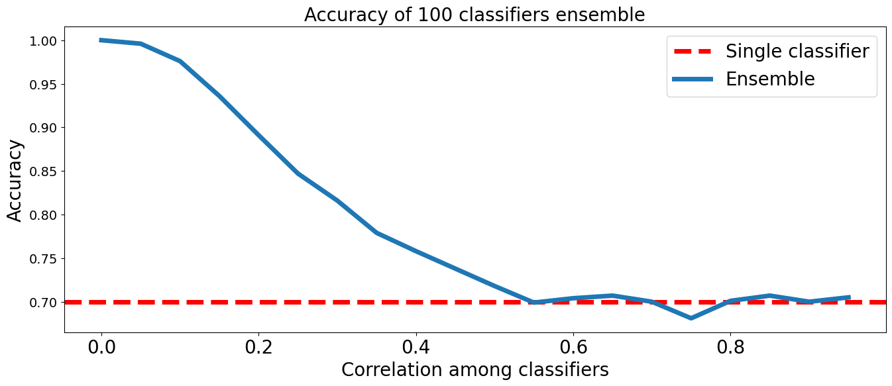

- Классическое машинное обучение -- [ссылка](https://colab.research.google.com/drive/1SeN_F4aI_3YsR9qYA2Kv9ZY4uL5bcxSC).
- # Необходимость методов классического машинного обучения
	- Существует ряд причин, почему важно знать и уметь применять методы классического машинного обучения:
	- **Недостаточный объем данных для нейронных сетей.** При малом объеме данных методы классического машинного обучения показывают более высокую эффективность.
	- **Табличные данные.** Решения на основе классического машинного обучения часто показывают сопоставимое или более высокое качество на табличных данных.
	- **Время получения решения задачи.** Скорость экспериментов и получения хорошего бейзлайна выше, чем у решения с помощью нейронных сетей.
	- **Интерпретируемость предсказаний.** Из методов классического машинного обучения легче получить важность каждого отдельно взятого признака.
	- **Комбинирование подходов.** В современных задачах часто используются комбинации нейронных сетей и алгоритмов классического машинного обучения. Например, можно использовать нейронные сети в качестве генераторов признаков для методов классического обучения.
- # Деревья решений
	- Деревья решений — это одни из первых моделей машинного обучения, которые были известны человеку. Изначально их строили без специальных алгоритмов, просто вручную. Когда требовалось принять решение по проблеме, для которой построено дерево, человек брал и проходился по этому дереву.
	  collapsed:: true
		- {:height 506, :width 982}
	- За принципом работы дерева решений стоит понятная интуиция. В каждом узле есть какой-то вопрос. Нормальное ли у человека слезоотделение, есть ли у него астигматизм и так далее. И, отвечая на каждый из этих вопросов, мы перемещаемся по дереву до тех пор, пока не придем к нужному типу линз.
	- Такое дерево решений можно построить без использования моделей машинного обучения, просто на основании опыта многих врачей ([экспертные системы 📚[wiki]](https://www.google.com/url?q=https%3A%2F%2Fru.wikipedia.org%2Fwiki%2F%25D0%25AD%25D0%25BA%25D1%2581%25D0%25BF%25D0%25B5%25D1%2580%25D1%2582%25D0%25BD%25D0%25B0%25D1%258F_%25D1%2581%25D0%25B8%25D1%2581%25D1%2582%25D0%25B5%25D0%25BC%25D0%25B0)).
	- Во многих задачах, где нет локальной связности данных, характерной для изображений и текстов, алгоритмы, основанные на деревьях решений, часто эффективнее, чем нейронные сети.
	- ## Принцип работы дерева решений
	  collapsed:: true
		- 
		- Проиллюстрируем принцип работы дерева решений. Допустим, есть 2 вещественных признака. Для каждой точки мы создаем вопрос: признак x1 больше 0.7 или меньше? Если больше 0.7, то это красная точка. Если меньше 0.7, то идем во второй внутренний узел t2 и спрашиваем: признак x2 меньше 0.5 или больше? Если меньше 0.5, то точка будет красная, в другом случае — синяя.
		- 
		- Дерево решений делит пространство признаков с помощью плоскостей на области, и в каждой из этих областей предсказывается константная величина.
	- ## Классификация
	  collapsed:: true
		- Деревья решений, как правило, используются при решении 2-х типов задач — классификации и регрессии. Примером классификации является предсказание типа линз. Предсказание может быть:
			- Жёстким (метка класса)
			- Мягким (вероятность класса)
		- Особенно актуальны модели, которые могут предсказывать вероятности классов. Жесткие предсказания — не самый удачный вариант, лучше оставить человеку возможность оценить результат и самому принять решение. К примеру, лекарства действуют с некоторой вероятностью, потому что невозможно учесть все факторы.
		- 
		- В листе находятся объекты разных классов. Для того, чтобы оценить вероятность принадлежности объекта к какому-то определенному классу, можно просто число представителей данного класса поделить на общее число объектов. Это дает нам одну важную интуицию: желательно, чтобы в листе было не очень мало объектов. Чем больше объектов, тем меньше ошибка.
		- Фактически это оценка генеральной совокупности по ограниченной выборке. Можно использовать [распределение Бернулли 📚[wiki]](https://www.google.com/url?q=https%3A%2F%2Fru.wikipedia.org%2Fwiki%2F%25D0%25A0%25D0%25B0%25D1%2581%25D0%25BF%25D1%2580%25D0%25B5%25D0%25B4%25D0%25B5%25D0%25BB%25D0%25B5%25D0%25BD%25D0%25B8%25D0%25B5_%25D0%2591%25D0%25B5%25D1%2580%25D0%25BD%25D1%2583%25D0%25BB%25D0%25BB%25D0%25B8) для двух классов или [мультиномиальное распределение 📚[wiki]](https://www.google.com/url?q=https%3A%2F%2Fru.wikipedia.org%2Fwiki%2F%25D0%259C%25D1%2583%25D0%25BB%25D1%258C%25D1%2582%25D0%25B8%25D0%25BD%25D0%25BE%25D0%25BC%25D0%25B8%25D0%25B0%25D0%25BB%25D1%258C%25D0%25BD%25D0%25BE%25D0%25B5_%25D1%2580%25D0%25B0%25D1%2581%25D0%25BF%25D1%2580%25D0%25B5%25D0%25B4%25D0%25B5%25D0%25BB%25D0%25B5%25D0%25BD%25D0%25B8%25D0%25B5) для большего количества классов.
		- ### Для бинарных признаков
			- Представим, что мы решаем задачу бинарной классификации (есть инфаркт у человека или нет).
				- Возьмем в качестве первого вопроса признак "боль в груди". В 1-ом и во 2-ом листах получается разное распределение людей. В левом листе инфаркт более вероятен, в правом — менее вероятен.
				- Другим признаком может быть “как хорошо циркулирует кровь”, в таком случае тоже получится неплохое разделение. Последний признак — “есть ли атеросклероз”.
				- Мы получили три разбиения по разным признакам. Теперь мы бы хотели выбрать лучший признак, для этого нам нужно их сравнить.
				- {:height 575, :width 1001}
			- Логично выбрать такое разбиение, которое дает нам "хорошие" узлы — те, в которых преимущественно сосредоточены объекты одного класса.
			- Одна из используемых метрик называется [Gini ✏️[blog]](https://www.learndatasci.com/glossary/gini-impurity/) . Она считается по следующей формуле:
			  $$\large \text{Gini} = 1 - \sum_ip_i^2$$
				- $\text{Gini}$ — мера [неопределенности ✏️[blog]](https://quantdare.com/decision-trees-gini-vs-entropy/) значения класса внутри узла. Соответственно, чем она ниже, тем лучше получившийся узел.
			- Посчитаем $\text{Gini}$ для признака "Боль в груди":
			  collapsed:: true
			  $\text{Gini}_1 = 1- (\dfrac{105}{105+33})^2 - (\dfrac{33}{105+33})^2 = 0.364$
			  $\text{Gini}_2 = 1- (\dfrac{34}{34+125})^2 - (\dfrac{125}{34+125})^2 = 0.336$
				- 
			- Такую метрику можно посчитать для каждого узла. Дальше посчитать метрику для следующего узла. Дальше можем оценить, насколько стал лучше результат в зависимости от используемого признака.
				- $$\large \text{Impurity decrease} = \text{Gini}_0 - (\frac{n_1}{n_1+n_2}\text{Gini}_1 + \frac{n_2}{n_1+n_2}\text{Gini}_2),$$
					- где $n_1, n_2$ — число объектов в листьях,
					- $\text{Gini}_0$ — чистота исходного узла.
				- **Боль в груди:**
				  $\text{Impurity decrease} = 0.498 - (\dfrac{138}{138+159})\cdot 0.364 - (\dfrac{159}{138+159})\cdot 0.336 = 0.149$
				- **Хорошо циркулирует кровь:**
				  $\text{Impurity decrease} = 0.498 - (\dfrac{164}{164+133})\cdot 0.349 - (\dfrac{133}{164+133})\cdot 0.373 = 0.138$
				- **Есть атеросклероз:**
				  $\text{Impurity decrease} = 0.498 - (\dfrac{123}{123+174})\cdot 0.377 - (\dfrac{174}{123+174})\cdot 0.383 = 0.117$
				- Наибольший $\text{impurity decrease}$ в признаке “боль в груди”. Значит, мы возьмем “боль в груди” как признак, на основании которого продолжим строить дерево.
		- ### Для вещественных признаков
			- 
			- Вещественный признак сортируется, после чего мы выбираем оптимальный порог для разбиения. Для этого считаем $\text{impurity decrease}$ для каждого порога и выбираем лучший.
	- ## Регрессия
	  collapsed:: true
		- Для решения задач регрессии дерево строится практически так же, но есть несколько нюансов.
		- 
		- Как лучше всего одним числом охарактеризовать все эти объекты, попавшие в один лист?
		- 
		- Как мы помним из статистики, у нас нет однозначного ответа на этот вопрос. Мы можем для распределения всех этих объектов в листе предсказывать наиболее частое значение, медиану, среднее значение.
		- Обычно предсказывают среднее значение, потому что с ним легче всего работать и его чаще всего используют в статистике.
	- ## Свойства деревьев решений
	  collapsed:: true
		- 
		- У деревьев решений есть еще одно хорошее свойство. Позже вы познакомитесь с замечательной [теоремой об универсальном аппроксиматоре 📚[wiki]](https://ru.wikipedia.org/wiki/%D0%A2%D0%B5%D0%BE%D1%80%D0%B5%D0%BC%D0%B0_%D0%A6%D1%8B%D0%B1%D0%B5%D0%BD%D0%BA%D0%BE). Ее суть в том, что нейросеть с одним скрытым слоем сможет аппроксимировать любую заданную гладкую функцию.
		- Для деревьев решений есть аналогичная теорема, говорящая о том, что дерево может аппроксимировать любую заданную кусочно-постоянную функцию.
		- Дерево решений, в отличие от нейронной сети, может адаптироваться к выборке любого размера, любому количеству признаков. Для нейронной сети эта теорема предполагает, что можно бесконечно увеличивать скрытые слои.
		- В случае же с деревьями решений лист разбивается еще на 2 части. Это можно делать бесконечно до тех пор, пока в каждом листе не окажется по одному объекту. Это приведет к сильному переобучению, но если бы у нас была вся генеральная совокупность, мы бы выучили ее гораздо легче деревом решений, чем нейронной сетью.
		- ### Неустойчивость деревье решений
			- 
			- Деревья решений не используются в чистом виде, потому что они неустойчивы. Если у нас есть данные, и мы удалим из них несколько объектов, то дерево решений может сильно поменяться.
			- Видим, что даже деревья максимальной глубины 3 уже не совпадают между собой. Справедливо отметить, что у нас маленький датасет. Как правило, чем датасет больше, тем устойчивее будет получаться дерево на первых уровнях.
			- Если использовать деревья бОльшей глубины, то и структура деревьев (то, как они выглядят, даже если не обращать внимания на конкретные признаки в узлах) будет отличаться.
		- ### Переобучение деревьев
			- Если алгоритм при небольшом изменении признаков существенно меняет свое решение, то это указывает на возможное переобучение. Если алгоритм существенно реагирует на любой шум в данных, то доверять его решениям опасно.
			- В областях, покрашенных в оранжевый, модель будет классифицировать точки как объекты из класса $0$. В синих — как объекты из класса $1$.
			- Обратите внимание на странные рваные области на рисунке. В этих областях из-за шума, присутствующего в данных, оказались объекты другого класса. Дерево переобучилось под обучающую выборку.
			- Что произойдет, если мы возьмем разные разбиения данных на обучение и тест для одного и того же датасета?
			- Границы решений поменялись. Исчезли одни "рваные" границы и появились другие. Наше дерево неустойчиво, из-за малейшего шума в данных оно может поменять свое предсказание. Оно переобучается на шум в данных.
			- Говорят, что у такого дерева высокий **variance**.
			- Мы видим, что в то время как дерево большой глубины выучило нашу тренировочную выборку почти идеально, дерево малой глубины для многих объектов из тренировочной выборки предсказывает неверный класс. Причем, оно не может исправиться в силу ограничения на глубину.
			- В случае дерева с малой глубиной нам не хватает **сложности модели**, чтобы уловить **внутреннюю структуру данных**. Говорят, что у такой модели высокий **bias**.
	- ## Bias, Variance, Irreducible error
		- Можно показать, что ошибка любой модели раскладывается в сумму трех компонент:
		- $$ \large \text{Model error} = \text{Bias} + \text{Variance} + \text{Irreducible error} $$
		- ### Bias
			- Обычно высокий **bias** имеют модели, которые недостаточно сложны по сравнению с реальной закономерностью данных. Например, реальная зависимость, которую мы наблюдаем, нелинейная, а мы пытаемся аппроксимировать ее прямой линией. В этом случае наше решение заведомо смещено (biased) в сторону линейной модели, и мы будем систематически ошибаться в сравнении с реальной моделью данных.
			  collapsed:: true
				- 
		- ### Variance
			- Можно получить и обратную ситуацию. Если модель будет слишком сложная (в смысле своей выразительной способности) и "гибкая", то она сможет подстроиться под данные и выучить тренировочную выборку полностью. В этом случае модель будет подстраиваться под любой шум в данных и пытаться объяснить его какой-то сложной закономерностью.
			- Малое изменение в данных будет приводить к большим изменениям в прогнозе модели.
			  collapsed:: true
				- 
			- Иногда **bias** и **variance** представляют еще таким образом:
			  collapsed:: true
				- 1. Можно быть точным и попадать всегда в центр мишени — это соответствует низкому **bias** и низкому **variance**.
				- 2. Можно попадать примерно в центр мишени, но при этом с большим разбросом — низкий **bias**, но высокий **variance**.
				- 3. Можно стрелять кучно, но не в центр — это высокий **bias** и низкий **variance**.
				- 4. Можно просто стрелять наугад — это высокий **bias** и высокий **variance**.
				- 
		- ### Irreducible error
			- Если удачно подобрать модель и ее гиперпараметры, то гипотетически можно точно предсказать среднее значение ожидаемой величины, то есть получить и низкий **bias**, и низкий **variance**.
			- В реальности при измерении физической величины есть случайные непредсказуемые погрешности — отклонения от среднего. Из-за этого предсказания всегда будут иметь определенный уровень ошибки, ниже которого опуститься нельзя, — это и есть **irreducible error**.
			  collapsed:: true
				- 
		- ### Bias vs variance
			- В практических задачах не получается бесконечно уменьшать и Bias, и Variance — приходится искать **компромисс (bias-variance tradeoff)**. С какого-то момента при уменьшении Bias начнет увеличиваться Variance, и наоборот. Задача исследователя — найти точку оптимума.
			- Можно построить зависимость этих величин от сложности модели (capacity). По мере увеличения сложности Variance имеет тенденцию к возрастанию, а Bias — к убыванию. Более сложные модели подстраиваются под случайные шумы обучающей выборки, а более простые — не могут воспроизвести реальные закономерности.
				- 
			- Управлять эффектом **variance** и **bias** можно как с помощью выбора модели, так и с помощью выбора гиперпараметров модели.
			- По мере увеличения глубины дерева:
			- уменьшается абсолютное значение сдвига среднего значения предсказаний моделей относительно истинного значения (bias) — в среднем предсказания моделей становятся более точными,
			- увеличивается дисперсия предсказаний моделей (variance) — предсказания моделей становятся менее устойчивы и сильнее зависят от конкретной обучающей выборки.
			- *Деревья малой глубины имеют малую сложность и высокий Bias.**
			- *Деревья большой глубины имеют высокую сложность и высокий Variance.**
			- Заметим, что если бы мы могли не просто брать решение дерева, а привязывать к этому какую-то статистику, например, сколько деревьев, построенных по подобной процедуре, приняли такое же решение, то мы смогли бы получить более качественное решение.
			- Если наложить решающие границы 100 решающих деревьев, построенных на разных выборках из $x_1, x_2$, то мы увидим, что "хорошие области", соответствующие реальному разделению данных, будут общими между деревьями, а плохие — индивидуальны.
			- К сожалению, в реальности мы не можем брать бесконечное число наборов данных из генеральной совокупности.
- # Бутстрэп
	- Мы хотим получить какое-то представление о точности нашей оценки: качества модели, корреляции между двумя переменными и т.д. И мы не знаем, как распределена характеристика, которую мы оцениваем.
	- Есть много подходов к тому, как получить такую оценку, и один из них — бутстрэп.
	  collapsed:: true
		- 
	- Что мы делаем:
		- 1. Берём из нашего исходного датасета N выборок такого же размера с повторениями.
		- 2. Для каждой полученной выборки (т.н. **псевдовыборки**) считаем характеристику, для которой хотим получить оценку.
		- 3. Получаем N значений характеристики. Строим гистограмму этих значений, получаем примерное распределение нашей характеристики.
	- Можем построить 95% доверительный интервал для нашей характеристики. Для этого отрезаем 2.5% самых больших и самых малых значений.
	- Подробнее про [бутстрэп 🎓[article]](https://www.jstor.org/stable/2958830?typeAccessWorkflow=login&seq=1).
	- ## Построение доверительного интервала для качества метрики
		- ...
- # Ансамбли
	- Видим, что:
		- 1. Чем лучше базовый классификатор, тем меньше нужно классификаторов при прочих равных условиях для достижения высокого качества.
		- 2. Если качество базового классификатора даже чуть больше 0.5, то качество ансамбля растет с увеличением числа моделей в ансамбле.
		- 3. Если качество базового классификатора неотличимо от случайного (0.5), то качество ансамбля будет оставаться равным 0.5.
		- 4. Если качество базового классификатора ниже случайного (0.5), то качество ансамбля стремится к 0.
	- ## Коррелированность моделей
		- Посмотрим, как зависит качество предсказания от коррелированности предсказателей. Конкретно — от ожидаемой коррелированности вероятностей ошибиться на данном объекте для любой взятой пары классификаторов из ансамбля.
		  collapsed:: true
			- 
		- Видим, что по мере увеличения коррелированности моделей качество все больше и больше приближается к качеству одной базовой модели.
	- ## Bootstrap aggregating (Bagging)
		- Нам нужны классификаторы, которые сами по себе предсказывают лучше, чем случайные, при этом они должны быть не коррелированы. На самом деле это нетривиальная задача: откуда нам брать разные классификаторы, если у нас один датасет?
		- 
		- Первый вариант — нам поможет уже рассмотренный bootstrap:
			- 1. Делаем из нашего исходного датасета N выборок такого же размера с повторениями.
			- 2. На каждой **псевдовыборке** строим отдельную модель. Чтобы полученные модели были слабо зависимы, будем использовать алгоритм, который чувствителен к небольшим изменениям в выборке.
			- 3. Получаем N слабо зависимых моделей.
			- 4. Когда нам нужно сделать предсказание для нового объекта, делаем предсказание каждой из N моделей, а затем усредняем предсказание.
	- ## Метод случайных подпространств (Random Subspace Method, RSM)
		- Второй вариант получения псевдовыборок — семплировать не объекты, а признаки. При этом бесполезно иметь в выборке два одинаковых признака, так как потом мы делаем выборки меньшего размера, чем исходное число признаков, и без повторений.
		- 
		- Обычно для каждой модели выбирают:
			- для задач классификации: $$ \sqrt{featurecnt}$$
			- для задач регрессии: $$ \frac{featurecnt}{3}$$
		- Хотя строгих правил нет, этот параметр можно подбирать на кросс-валидации.
	- ## Комбинация RSM и Bagging
		- Можно объединить оба способа: для каждой базовой модели в ансамбле применяем бутстрэп к объектам (получается выборка исходного размера, но с повторяющимися объектами), и дополнительно отбираем случайное подножество признаков. В этом случае мы получим еще более сильно отличающиеся друг от друга случайные выборки.
		- Для реализации комбинации RSM и Bagging в `BaggingClassifier` и `BaggingRegressor` требуется передать параметр `max_features` и `bootstrap=True`.
		- 
	- ## Почему для одних классов моделей работает, а для других — нет?
		- Чтобы простое голосование повышало качество ансамбля, необходимо, чтобы ошибки базовых моделей не коррелировали между собой.
		- Попробуем оценить попарную корреляцию в ошибках базовых моделей в ансамблях.
		- Можно сделать следующие выводы:
			- 1. Bagging, RSM и их комбинация помогают уменьшать корреляцию между базовыми моделями. Причем, комбинация Bagging и RSM работает лучше, чем каждый из них поодиночке.
			- 2. В случае Bagging дерево решений получает существенный прирост качества за счет того, что модели на его основе коррелированы значительно слабее, чем модели на основе логистической регрессии.
			- 3. Отсутствие корреляции при RSM и BagRSM для Log-Reg связано с отсутствием важных признаков при обучении некоторых моделей. Предсказание моделей на разных выборках при одинаковых признаках будет мало отличаться. Из-за этого ансамбль на основе деревьев решений опять показывает лучший результат.
	- ## Случайный лес
	  collapsed:: true
		- Из предыдущей части мы увидели, что использование Bagging или RSM для Log-Reg или подобных моделей не несет большого смысла. Но для деревьев решений это не так. Будем брать деревья большой глубины. Незначительные изменения в данных приводят к значительным  изменениям в топологии таких деревьев. Таким образом, мы приходим к **случайному лесу** = Bagging + RSM над деревом решений.
		- При этом RSM в классическом случайном лесе делается не на уровне дерева, а на уровне узла. В каждом узле дерева, когда мы выбираем лучшее разбиение его на два дочерних, мы просматриваем не все признаки, а только определенное их количество.
		- 
		- Случайный лес работает лучше, чем отдельное случайно взятое дерево. Но главное, что случайный лес намного более устойчив к шуму.
		- Это свойство до сих пор позволяет случайному лесу успешно использоваться в областях с шумными данными.
			- ### Зависимость качества случайного леса от числа деревьев
				- Для случайного леса верно следующее: когда мы берем множество базовых классификаторов (в данном случае деревьев) и усредняем их, то **результат этих усреднений стремится к идеальному дереву решений**, причем построенному на идеальных, а не на исходных признаках.
				- Увеличение числа базовых моделей сначала сильно улучшает качество модели. Однако после определенного количества базовых моделей улучшение качества становится незначительным.
			- ### Зависимость качества RF от глубины дерева
				- Чем больше глубина дерева, тем большая нескоррелированность базовых моделей будет получаться. В общем случае в случайном лесе важно использовать именно глубокие деревья, причем в большинстве случаев их глубину не надо ограничивать (или ограничивать большими значениями порядка 10–12).
				- Обучим случайный лес с заданной глубиной дерева и сравним с одиночным деревом такой же глубины.
				- Лучшие результаты показывает случайный лес из наиболее глубоких деревьев.
				- Качество случайного леса с малой глубиной дерева не отличается от качества одиночного дерева той же глубины. Это связано с тем, что деревья малой глубины слабо отличаются друг от друга (высокий bias и низкий variance), потому усреднение их предсказаний почти не улучшает качество.
				- Отметим, что в случае малых выборок ограничения на глубину дерева могут дать выигрыш.
			- ### Минимальное число объектов в листе.
				- Иногда качество случайного леса можно улучшить, если поставить небольшое ограничение на минимальное число объектов в листе, чтобы запретить явно переобученные деревья.
				- В данном случае, однако, ограничение на количество объектов в листе ухудшает качество ансамбля. Одна из причин заключается в том, что с увеличением числа ограничений на дерево уменьшается непохожесть деревьев друг на друга, и качество случайного леса также начинает уменьшаться.
			- ### Переобучение RF
				- Существует мнение, что случайный лес не переобучается. Это не так. Можно подобрать такие два набора параметров, что первый даст лучшее качество на тренировочной выборке, а второй — на тестовой. При этом увеличение числа деревьев в ансамбле с этим справиться поможет слабо.
				- Возьмем, к примеру, наш синтетический пример на плоскости.
				- Лес без ограничения на минимальное число объектов в листе переобучился — достиг максимального качества на обучающей выборке, но на тестовой имеет качество ниже, чем лес с ограничением.
			- ### Валидация случайного леса на Out-Of-Bag (OOB) объектах
				- Благодаря механизму обучения случайного леса у нас появляется еще один способ валидировать модель. Для обучения каждого дерева используются не все объекты нашей выборки, следовательно, мы можем получать предсказания деревьев на объектах, которые не использовались для обучения этих деревьев.
				- Важно понимать, что OOB score не заменяет другие способы валидации, а является дополнительным способом, который используется в основном тогда, когда данных мало.
			- ### Случайный лес и bias-variance tradeoff
				- Случайный лес — инструмент для уменьшения variance нашей модели. Можно показать, что при стремлении числа моделей в ансамбле к бесконечности, а их коррелированности — к 0, variance ансамбля стремится к нулю. Однако при этом bias ансамбля будет равен bias базовой модели.
				- Видим, что общая сложность решающей границы меняется не сильно: bias случайного леса по сравнению с bias дерева решений не меняется.
				- А вот гладкость границы увеличивается, тем самым, уменьшается variance
		-
	- ## Boosting
		- Бустинг — это еще один способ ансамблирования моделей. В отличие от случайного леса, где каждая модель в ансамбле строится независимо, в бустинге построение очередной модели зависит от уже состоящих в ансамбле моделей. Каждая следующая модель в ансамбле стремится улучшить предсказание всего ансамбля.
		- Бустинг позволяет нам на основе большого числа "слабых" моделей получить одну "сильную". Под слабыми моделями подразумеваем модели, точность которых может быть лишь немногим выше случайного угадывания.
		- В качестве моделей традиционно используются деревья решений, но не большой глубины, а наоборот — маленькой, чтобы каждое из них не могло выучить выборку хорошо.
		- 
		- Из всех бустингов больше всего прославился и доказал свою эффективность **градиентный бустинг**. Он позволяет получить решение, которое сложно побить другими видами моделей.
	- ## Gradient boosting
		- Начнем с интуиции. Предположим, что мы играем в гольф. Наша задача — загнать мячик в лунку, причем, когда мячик далеко от нее, мы можем ударить посильнее, чтобы сократить расстояние, но когда мы уже близко к лунке, то стараемся бить клюшкой аккуратнее, чтобы не промахнуться. После каждого удара мы оцениваем расстояние до лунки и приближаем мячик в ее сторону. Применительно к нашей теме, удар клюшкой по мячику — это каждая модель в градиентном бустинге.
		- [[colab] 🥨 Демонстрация интуиции градиентного бустинга](https://colab.research.google.com/drive/1hILdJzsuAsXabA4aIwtb9RGgUn_bvhCL)
		- 
		- Цель $i$-той модели в ансамбле — скорректировать ошибки предыдущих ${i-1}$ моделей. В результате, когда мы суммируем вклады всех моделей ансамбля, получается хорошее предсказание.
		- Давайте формализуем, что нам нужно, чтобы обучить алгоритм градиентного бустинга:
			- набор данных $\left\{\left(x_i, y*_i\right)\right\}_*{i=1, \ldots, n}$,
			- число итераций $M$ (оно же количество моделей),
			- выбор дифференцируемой функции потерь $L(y, f)$,
			- выбор семейства функций базовых алгоритмов $h(x, \theta)$ с процедурой их обучения.
		- Минимизировать ошибку будем с помощью градиентного спуска.
		- 
		- [[blog] ✏️ Подробнее о градиентном бустинге](https://habr.com/ru/company/ods/blog/327250/)
		- [[demo] 🎮 Gradient Boosting explained](https://arogozhnikov.github.io/2016/06/24/gradient_boosting_explained.html)
		- [[demo] 🎮 Gradient Boosting Interactive Playground](https://arogozhnikov.github.io/2016/07/05/gradient_boosting_playground.html)
		- Когда мы говорили про базовые модели, то предполагали, что это деревья решений. Но это необязательно, можно использовать и другие алгоритмы в качестве базовых моделей. Деревья решений имеют ряд преимуществ:
			- Гибкость — деревья решений могут описывать сложные нелинейные взаимосвязи между объектами и целевой переменной. Они могут обрабатывать как числовые, так и категориальные данные и работать с пропущенными значениями.
			- Интерпретируемость — деревья решений просты в понимании и интерпретации. Они дают четкое представление о том, как модель пришла к определенному прогнозу.
			- Устойчивость к выбросам — деревья решений менее чувствительны к выбросам, чем другие алгоритмы машинного обучения. Они способны изолировать их и предотвратить их влияние на всю модель.
			- Эффективность — деревья решений могут быть построены быстро, они способны обрабатывать большие наборы данных.
		- ### Переобучение
			- **Gradient boosting**, в отличие от случайного леса, может сильно переобучиться. Это важно понимать. Для небольших датасетов часто может оказаться, что случайный лес дает более надежные результаты.
			- Здесь мы *немного* схитрили, сильно увеличив learning rate нашей модели — дополнительный множитель к весу, с которым добавляются в нее новые модели. Из-за этого даже на таком простом датасете мы в состоянии увидеть явное переобучение.
			- Давайте об этом learning rate и поговорим.
		- ### Shrinkage (learning rate)
			- Мы не хотим сильно скакать по пространству решений, мы хотим спускаться медленно и сойтись к какому-то хорошему минимуму. Потому вес каждой модели, которую мы рассчитываем по специальному алгоритму, еще домножаем на маленький коэффициент, который называется shrinkage или learning rate. Фактически, мы берем и умножаем градиент на некий $\alpha$ (то же, что было в градиентном спуске, ничего нового мы не добавили).
			- Если не домножать вес каждой модели дополнительно на этот параметр, то мы можем попасть в ситуацию, когда будем пролетать мимо минимума функции ошибки (та же опасность, что и в обычном градиентном спуске).
			- 
			- В данном случае мы видим, что значение learning rate, установленное по умолчанию (`learning_rate=0.1`), позволяет получить наименьшую ошибку на валидации.
				- Слишком большие значения learning rate (1 и 0.5) приводят к тому, что мы не достигаем таких глубоких минимумов и начинаем переобучаться.
				- Слишком малое значение learning rate может привести к тому, что нам понадобится очень большое число деревьев, чтобы достигнуть минимума (если мы его вообще достигнем).
		- ### Число деревьев в ансамбле
			- Число деревьев, как было видно из предыдущего графика, зависит от установленного learning rate. Поэтому обычно ставят `learning_rate = 0.1` и подбирают оптимальное значение числа деревьев в ансамбле. Делают это на кросс-валидации, но для экономии времени просто дополнительно разобьем train датасет:
		- ### Глубина деревьев в GB
			- В случае бустинга нам нужны **слабые модели**. Поэтому очень глубокие деревья в бустинге встречаются редко — бустинг с ними проигрывает по качеству.
			- Обычно глубина дерева выбирается вместе с минимальным числом объектов в листе `min_samples_leaf` или весом листа `min_weight_fraction_leaf`, так как эти параметры взаимосвязаны и вместе влияют на сложность полученных деревьев.
			- Здесь же в целях демонстрации мы подберем сначала глубину дерева, а потом минимальное число объектов.
		- ### Минимальное число объектов в листе
			- Этот параметр влияет на сложность полученных деревьев. Как уже отмечалось ранее, стоит подбирать его вместе с глубиной, но мы ограничены по времени.
		- ### Subsample и max_features
			- Можно каждому дереву в ансамбле давать только часть объектов из выборки — получим стохастический градиентный бустинг. За это отвечает параметр `subsample`.
			- Аналогично можно давать каждому дереву в ансамбле лишь часть признаков — `max_features`.
			- Это может давать дополнительный прирост качества. Сейчас мы этот этап опускаем, так как у нас мало признаков и не очень много объектов, а также в целях экономии времени.
		- ### Понижение learning rate
			- После того, как мы подобрали остальные параметры, можно попытаться выиграть дополнительное качество за счет понижения `learning_rate` и одновременного увеличения числа деревьев в ансамбле.
			- Построим график качества для текущего `learning_rate` — мы же брали не оптимальное число предсказателей. Посмотрим, можно ли уже на финальном этапе взять побольше.
		- ### Градиентный бустинг и bias-variance tradeoff
			- В то время как случайный лес уменьшал только variance модели, бустинг стремится уменьшить и bias, и variance.
	- ## Модификации градиентного бустинга
		- Есть много модификаций градиентного бустинга. В отличие от реализации в `sklearn`, большая часть из них умеет параллелиться на CPU или даже на GPU.
		- Поэтому при работе с реальными данными использовать градиентный бустинг из `sklearn` не стоит. Другие реализации бустинга дадут результат лучше и быстрее.
		- ### XGBoost
			- [[doc] 🛠️ Официальная документация](https://xgboost.readthedocs.io/en/stable/)
			- Одной из ключевых идей реализации является оптимизация траектории градиентного спуска. Полезно будет спускаться медленно, и чтобы модели по пути не были сложными, достаточно минимального отличия от случайной модели.
			- Для этого XGBoost вводит специальный штраф за сложные деревья (большей глубины, чем 2–3). За счет того, что в градиентном бустинге можно минимизировать любую дифференцируемую функцию ошибок, мы просто добавляем штраф напрямую в функцию ошибок исходного градиентного бустинга.
			- 
			- Пусть и незначительно, но XGBoost лучше GBR. И, главное, в разы быстрее.
			- Также XGBoost немного иначе определяет важность листа: не сколько именно объектов попало в лист, а каково отличие предсказаний на разных объектах в листе. Из-за этого способа параметр `min_child_weight` может принимать нецелые значения, в том числе меньше 1 (к примеру, в случае задачи классификации).
			- Попробуем подобрать только этот параметр. Заметьте, мы можем спокойно использовать 2000 деревьев, не боясь ждать результата расчетов долгое время.
		- ### LightGBM
			- [[doc] 🛠️ Официальная документация](https://lightgbm.readthedocs.io/en/stable/)
			- LightGBM изначально содержит различные оптимизации, ускоряющие его работу. Кроме этого, LightGBM по умолчанию строит дерево немного иначе, нежели XGBoost.
			- XGBoost по умолчанию строит дерево по уровням — на каждом уровне происходит разбиение узлов, если это приводит к уменьшению ошибки. Ограничены мы только максимальной глубиной дерева.
			- LightGBM же строит дерево по узлам. На каждом шаге разбивается тот узел, разбиение которого сильнее всего минимизирует функцию ошибки, ограничения на глубину нет. В LightGBM вводится ограничение не на глубину дерева, а на общее число листьев в итоговом дереве.
			- 
		- ### CatBoost
			- [[doc] 🛠️ Официальная документация](https://catboost.ai/en/docs/)
			- Разработан Яндексом.
			- 1. Хорошо умеет работать с категориальными признаками. Если у вас много категориальных признаков, он может дать существенный выигрыш.
			- 2. Умеет работать с текстом без предварительной обработки. Достаточно указать, что колонка содержит текстовый признак.
			- 3. По умолчанию использует в качестве модели модификацию обычного дерева решения — Symmetric Tree, которое менее склонно к переобучению.
		- ### Optuna
			- Для оптимизации гиперпараметров существуют готовые решения, которые используют различные методы black-box оптимизации. Разберем одну из наиболее популярных библиотек — [**Optuna** 🛠️[doc]](https://optuna.org/).
			- Есть интеграции с scikit-learn, XGBoost и LightGBM, но мы рассмотрим общий случай, который подойдет для любой модели, даже нейронной сети.
		- ### Подбор параметров модифицированных бустингов
			- Каждый из модифицированных бустингов имеет свои особые параметры и рекомендации от создателей и участников Kaggle, как и в каком порядке выбирать параметры. Если вы решили использовать тот или иной вид бустинга в своей задаче, ОЗНАКОМЬТЕСЬ c этими советами.
			- Все три бустинга, к примеру, позволяют задавать не только число признаков, использующихся в каждом узле, но и число признаков, использующихся в каждом дереве в целом.
			- Кроме того, все три бустинга имеют настройки, ускоряющие их работу (у LightGBM эти настройки выставлены по умолчанию), и все три бустинга умеют работать на GPU.
			- Здесь мы бегло пробежались по самым верхам, копируя подобранные на предыдущих этапах параметры.
		- ### Про другие реализации случайного леса
			- В XGBoost и LightGBM есть свои, более быстрые и иногда более эффективные реализации случайного леса. Но их надо дополнительно настраивать.
	- ## Блендинг и стэкинг
		- До этого мы использовали два подхода. Первый подход — берем много предсказаний большого количества моделей и усредняем (считаем, что модели равноправны).
		- $$\large h(x) = \dfrac 1 k \sum_{i=i}^k  a_i (x) $$
		- Потом задумываемся о том, что каждая модель предсказывает в целом по-разному. Одна модель ошибается в $10\%$ случаев, другая — в $15\%$ и так далее. Было бы неплохо к предсказаниям этих моделей подобрать веса. Так рождается идея того же бустинга.
		- $$\large h(x) = \sum_{i=i}^k b_i a_i (x) $$
		- Следующий логичный шаг — подумать о том, что каждая модель может ошибаться на каких-то своих объектах. Например, при предсказании, насколько велика вероятность, что человек серьезно заболеет, одна модель будет плохо работать для европейцев, а другая — для жителей Новой Гвинеи.
		- $$\large h(x) = \sum_{i=i}^k b_i(x) a_i (x) $$
		- Получается ситуация, в которой то, насколько хорошо будет предсказывать модель, зависит от самого объекта. Фактически это означает то, что мы бы хотели для каждого объекта получать какой-то вектор весов, а дальше суммировать предсказания моделей $a_i$, используя эти веса.
		- Как получать эти веса для каждого объекта?
		- Обучим еще одну модель, которая явно или неявно предсказывает веса алгоритмов и агрегирует их предсказания. Называться она будет **мета-алгоритмом**.
		- Обычно в качестве мета-алгоритма используются сравнительно простые модели, например, линейные.
		- Как получить такую модель? Есть два распространенных подхода — **stacking** и **blending**
		- ### Blending
			- На соревновании Netflix Prize была поставлена задача — предсказать, как люди оценят тот или иной фильм.
			- Победил подход, основанный на таком объединении моделей, при котором у вас каждая модель получает вес в зависимости от объекта. Подход называется **блендинг**.
			- Отличительной особенностью такого способа ансамблирования является использование моделей разной природы.
			- Разберем пошагово, как реализуется блендинг:
			  collapsed:: true
				- 1. Делим данные на подвыборки. Обучающая выборка состоит из двух подвыборок — одна для обучения ансамбля алгоритмов (чаще это выборка побольше), другая для обучения мета-алгоритма.
				- 2. Обучаем ансамбль на первой выборке.
					- 
				- 3. Получаем предсказания ансамбля на объектах второй выборки.
				- 4. Используем эти предсказания как признаки для обучения мета-алгоритма.
					- 
				- 5. Получаем предсказания на тестовой выборке.
					- 
			- Недостатком блендинга является то, что мы дополнительно разбиваем обучающую выборку, так как нельзя учить и базовые алгоритмы, и мета-алгоритм на одних и тех же данных.
			- Для улучшения качества можно сделать несколько блендингов (по-разному разбивая обучающую выборку на подвыборки), а дальше усреднять предсказания разных блендингов.
		- ### Stacking
			- Также можно использовать другой способ, который позволяет использовать всю обучающую выборку.
			- Вместо того, чтобы делить обучающую выборку на подвыборки, давайте использовать кросс-валидацию.
			- Для этого:
			  collapsed:: true
				- 1. Делим обучающий набор на блоки.
					- 
				- 2. Обучаем базовую модель из ансамбля на каждом кросс-валидационном разбиении. На блоке, который не вошел в обучение, делаем предсказание. Получаем предсказания для всех объектов обучающей выборки. Повторяем процедуру для каждой модели в ансамбле.
					- 
				- 3. Обучаем метаалгоритм на полученных признаках
					- 
				- 4. Для предсказания на тестовых данных ансамбль базовых алгоритмов переучивается на всей тренировочной выборке.
					- 
				- 5. Используем этот ансамбль для получения признаков для предсказания мета-алгоритма
					- 
				-
			- Стэкинг, в отличие от блендинга, использует всю тренировочную выборку. Но этим мы вносим несколько проблем, одной из которых является то, что ансамбль, на предсказаниях которого мы учили мета-алгоритм, и ансамбль, предсказания которого мы в итоге используем, немного отличаются. Такой подход более склонен к переобучению. Для борьбы с ним можно, к примеру, подмешивать к предсказаниям базовых моделей шум. Также, по причине того, что нам надо делать предсказание на кросс-валидации, работать этот метод будет дольше, чем Blending.
	- ## Применение нейронных сетей к табличным данным
		- Есть попытки построить архитектуры нейронных сетей таким образом, чтобы они могли работать с табличными данными.
		- Можно отметить архитектуру от Яндекса
		- [NODE 🎓[arxiv]](https://arxiv.org/pdf/1909.06312.pdf) и [TabNet 🎓[arxiv]](https://arxiv.org/pdf/1908.07442.pdf), [TabNet 🐾[git]](https://github.com/dreamquark-ai/tabnet) от Гугл.
		- Вторая работа особенно удачна и уже активно используется в соревнованиях на Kaggle. Стоит отметить, что победы над древесными моделями не одержано. Но полученная модель иногда достигает их качества и обладает рядом интересных особенностей:
			- 1. Как и любая другая нейросетевая архитектура, она дифференцируема. Можно вставить обученную нейросеть как часть другой и использовать transfer learning и прочее.
			- 2. Нейросеть автоматически выбирает признаки, поэтому feature importance можно получить без дополнительных ухищрений.
			- 3. Ее можно обучать в semisupervised манере: сначала предобучить на неразмеченных данных, а потом уже использовать размеченные.